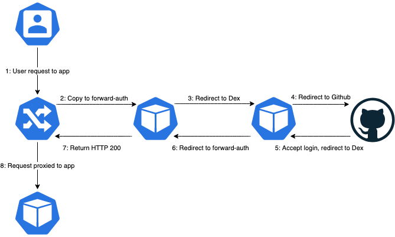

# Traefik-Forward-Auth Example Setup

This repo shows an example of a full-cycle setup using Traefik, Traefik-Forward-Auth, and Dex to put Github authentication in front of an arbitrary Kubernetes web service.

This is not a specific turnkey solution, but rather an interactive example to adapt to your own needs. Notably if your authentication provider supports OpenID Connect natively (or if you are using Google Authentication), you can entirely skip Dex and have traefik-forward-auth talk to the provider directly.

## The Components

* [Traefik](https://github.com/containous/traefik) - A proxy server that also serves as a Kubernetes Ingress Controller.
* [Traefik-Forward-Auth](https://github.com/thomseddon/traefik-forward-auth) - An adapter between the forward-auth protocol and OpenID Connect.
* [Dex](https://github.com/dexidp/dex) - An OpenID Connect server that supports numerous authentication backends, in this case Github OAuth.
* [Cert-Manager](https://github.com/jetstack/cert-manager) - Playing a supporting role, creating and managing TLS certificates.
* Whoami and Microbot - Two example applications, one using the normal Ingress resource, the other the custom IngressRoute.

Each of these is set up in a YAML manifest, with annotations in line.

## Request Flow

## Questions?

You can find me as `@coderanger` on the Kubernetes Slack.

## License

Except for the cert-manager installation manifest which is provided under the original Apache license:

To the extent possible under law, I waive all copyright and related or neighboring rights to this work.
